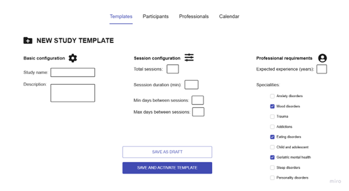
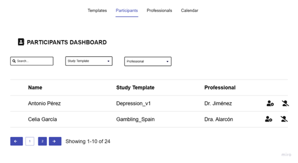
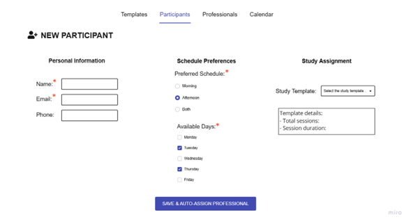
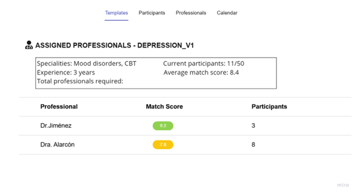
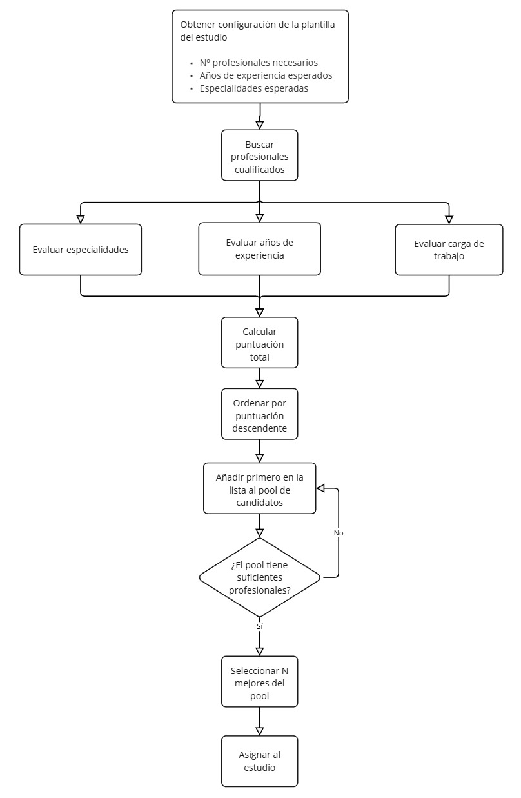
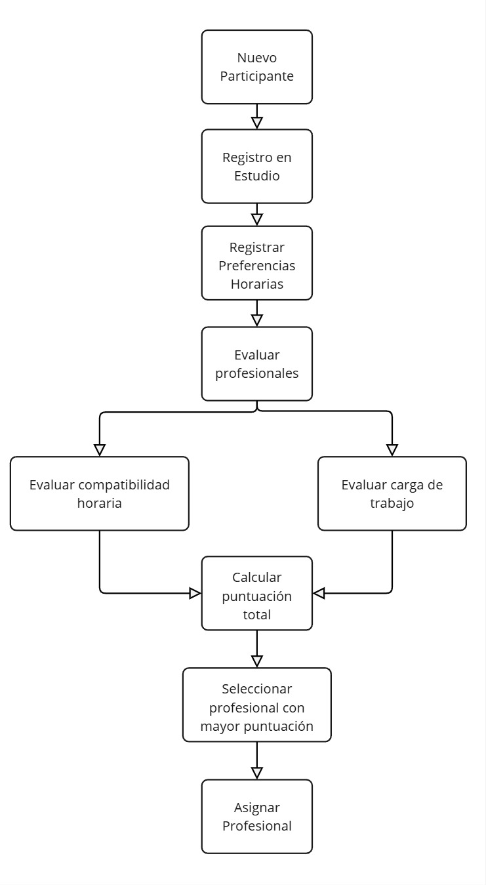
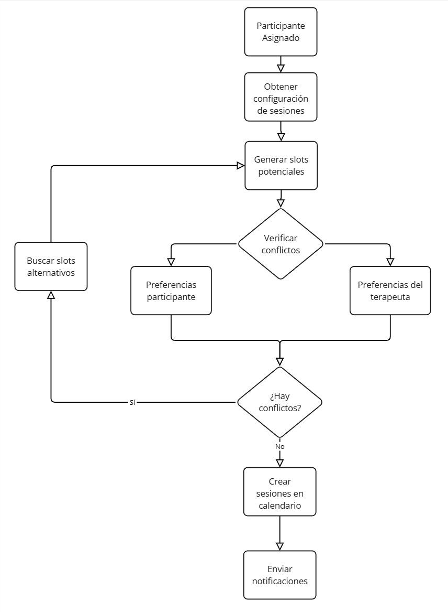
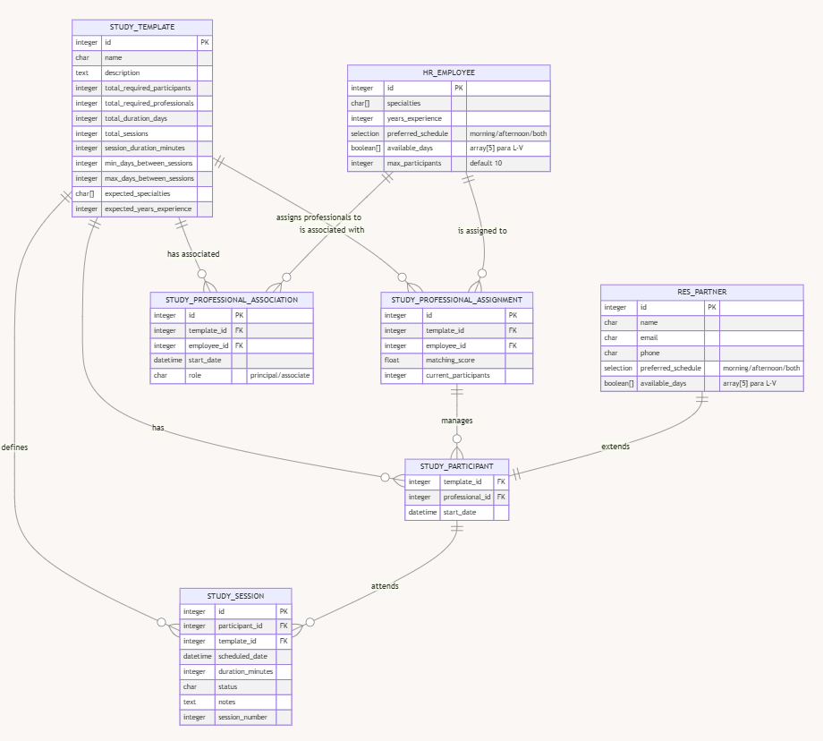

# Clinical Studies Management

## 1. Nombre del módulo
`clinical_studies_management`

## 2. Descripción corta
Sistema automatizado para la gestión integral de estudios clínicos en salud mental. Permite configurar plantillas de estudios, gestionar asignaciones inteligentes de profesionales y participantes mediante algoritmos de puntuación, y generar automáticamente calendarios optimizados para las sesiones, asegurando eficiencia y personalización en la planificación de los estudios.

## 3. Descripción detallada de funcionalidades

### A. Gestión de Plantillas de Estudios
El sistema permitirá crear una plantilla con toda la configuración necesaria para poder automatizar la asignación de los terapeutas más adecuados para cada estudio en base a su puntuación en factores de interés como su especialidad, antigüedad, carga de trabajo u otros.

- **Configuración básica**
    - Nombre y descripción del estudio
    - Número de participantes requeridos
    - Número de terapeutas requeridos
    - Duración total estimada

- **Configuración de Sesiones**
    - Número total de sesiones
    - Duración de cada sesión
    - Intervalo mínimo entre sesiones
    - Intervalo máximo entre sesiones

- **Requisitos de Personal**
    - Especialidades esperadas (ej: depresión, ansiedad, adicciones)
    - Años de experiencia esperados
    - Disponibilidad horaria requerida

### B. Asignación Automatizada de Profesionales a Plantillas
- **Motor de Asignación de Profesionales**: Esta automatización permitirá obtener una puntuación de la afinidad de un terapeuta con respecto a un proyecto. Además, asignará a los terapeutas más adecuados en función de su perfil y de las características del estudio.
    - Validación de especialidades requeridas
    - Verificación de disponibilidad horaria
    - Control de carga de trabajo actual
    - Sistema de puntuación basado en:
        - Coincidencia de especialidades
        - Experiencia en el tipo de estudio
        - Carga actual de trabajo

- **Motor de Asignación de Participantes**: cuando un participante es dado de alta en una plantilla de estudio, el motor busca el terapeuta con mayor afinidad teniendo en cuenta las preferencias horarias de ambos y la carga de trabajo actual del profesional.
    - Matching con profesionales según:
        - Preferencias horarias del participante
        - Disponibilidad del profesional
        - Carga actual del profesional

### C. Generación Automática de Calendario
- **Planificador Inteligente**
    - Generación de calendario respetando:
        - Intervalos entre sesiones definidos
        - Disponibilidad del profesional
        - Disponibilidad del paciente
    - Sistema de notificaciones de cambios
    - Programación de recordatorios tanto a participante como a terapeuta

## 4. Mapa del módulo
El módulo permitirá gestionar plantillas, profesionales y participantes. La asignación de profesionales a una determinada plantilla se realizará de manera automática considerando datos del estudio y del profesional. El apartado de profesionales será de consulta, para comprobar el estado de cada uno de ellos y manejar cargas de trabajo. Por último, el apartado participantes permitirá crearlos con diferentes datos que también serán utilizados para la correcta asignación de profesionales y programación de sesiones.

## 5. Dependencias
- `base`
- `mail`: Notificaciones
- `calendar`: Gestión de calendario
- `hr`: Información de profesionales

## 6. Wireframes
El módulo requerirá el desarrollo de las siguientes pantallas para permitir la visualización y edición de plantillas. Además, se emplearán módulos de Odoo ya existentes para las vistas de calendario y de información particular de profesionales y participantes.

### - Templates Dashboard (Home)

### - New Study Template

### - Participants Dashboard

### - New Participant

### - Assigned Professionals

## 7. Control de accesos

### Grupos de Usuario

#### Study_professional_principal
- **Permisos**:
    - Permisos: CRUD en `study_template`, `study_professional_role`, `study_professional_assignment`, `study_participant`, `study_session`
    - Vista global del calendario
    - Gestión completa de asignaciones

#### Study_professional_associate
- **Permisos**:
    - Permisos: R en `study_template`, RU en sus `study_professional_role`, `study_professional_assignment`, `study_participant` y `study_session`
    - Ver su calendario
    - Gestionar sus participantes asignados

## 8. Diagramas de flujo

- **Flujo de Asignación de Profesionales a Plantilla de Estudio**: Este flujo se activa manualmente una vez se ha configurado la plantilla de un nuevo estudio. Se basa en los requisitos especificados para calcular una puntuación para cada profesional. La fórmula es la siguiente, dando puntuaciones entre 0-10.

    - Coincidencia de especialidades (40%)
        - Puntuación = (especialidades coincidentes / Total especialidades esperadas) x 40
    - Años de experiencia (30%)
        - Puntuación = (años experiencia / años experiencia esperados) x 30
    - Carga actual de trabajo (30%)
        - Puntuación basada en participantes actuales:
            - 0-2: 30
            - 3-4: 25
            - 5-6: 20
            - 7-8: 10
            - 9: 5
            - 10: 0

    En caso de que no haya los suficientes para cumplir el mínimo, se notifica y se da la posibilidad de modificar la configuración de la plantilla antes de volver a realizar la asignación automática.

    

- **Flujo de Asignación de Participante**: comienza automáticamente cuando un participante es asignado a un estudio activo. Registra la información necesaria para poderle asignar el profesional más adecuado. La puntuación se calcula basándose en:

    - Compatibilidad de horarios (70%)
        - Días de la semana (40 puntos):
            - Coinciden 3 o más: 40
            - Coinciden 2: 25
            - Coincide 1: 10
            - Sin coincidencia: 0
        - Franja horaria preferida (30 puntos):
            - Coincidencia total: 30
            - Coincidencia parcial: 15
            - Sin coincidencia: 0

    - Carga actual del profesional (30%)
        - Participantes actuales:
            - 0-2: 30
            - 3-4: 25
            - 5-6: 20
            - 7-8: 10
            - 9: 5
            - 10: 0

    

- **Flujo de Generación de Calendario**: se inicia de manera automática cuando un participante se asocia a un terapeuta. Obtiene la configuración de sesiones de la plantilla del estudio y distribuye la intervención para que cumpla con las preferencias del participante y el horario del terapeuta.

    

## 9. Esquema relacional

## 10. Comunicación con otros módulos
- **Módulo mail**
    - Enviar notificaciones y recordatorios
        - Asignación de terapeuta a plantilla de estudio
        - Asignación de nuevo participante a terapeuta
        - Programación de nuevas sesiones
        - Notificaciones de cambios en el calendario
- **Módulo calendar**:
    - Gestionar sesiones clínicas
        - Sincronizar calendarios de terapeutas y pacientes
- **Módulo HR**
    - Obtener información de los terapeutas
        - Información básica
        - Especialidades y experiencia
        - Horario laboral y disponibilidad
- **Módulo base**
    - Gestión de participantes
        - Información de contacto
        - Preferencias horarias

> Written with [StackEdit](https://stackedit.io/).
